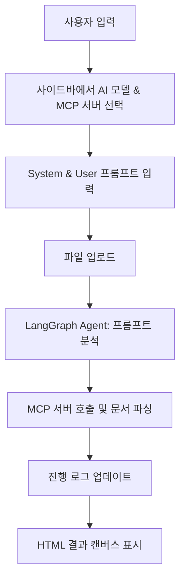

좋습니다 👍 요청 주신 기준(sequential-thinking, context7)과 기술 스펙(streamlit, langgraph, multi-agent)을 반영해 **PRD 초안**을 작성했습니다.

---

# PRD: AI 멀티에이전트 기반 문서 파싱 및 시각화 도구

## 1. 목적 (Purpose)

AI 멀티에이전트 시스템을 활용하여 다양한 문서(PDF, Excel, Word, HWP 등)를 업로드하면 자동으로 HTML로 파싱하고, 사용자가 프롬프트를 통해 제어할 수 있는 **인터랙티브 문서 변환 플랫폼**을 제공한다.

---

## 2. 대상 사용자 (Target Users)

* 교수, 강사, 연구원 등 문서 기반 강의/연구 준비를 하는 전문가
* 업무용 문서를 다루는 기획자, 분석가
* 문서를 일괄적으로 변환하고 재사용하려는 개발자/엔지니어

---

## 3. 핵심 기능 (Core Features)

### 3.1 사이드바

* **AI 모델 다중 선택**

  * 기본: 전체 선택 상태
  * 예: `gemma3:1b`, `qwen3:1.7b`
* **MCP 서버 다중 선택**

  * 지원 파싱 대상: `pdf`, `excel`, `doc`, `hwp`
  * 기본: 전체 선택 상태

### 3.2 작업영역

* **프롬프트 입력 창**

  * 구분: `system`, `user` 프롬프트 별도 입력 가능
* **다중 파일 업로드 영역**

  * 드래그 & 드롭 + 변경 가능 기능
* **파싱 진행 로그 영역**

  * 단계별 로그 표시
  * 상하 스크롤 가능

### 3.3 캔버스 영역

* 파싱 완료 후 HTML 결과 표시
* 실시간 업데이트 지원

---

## 4. 시나리오 (User Scenario)

1. 사용자가 사이드바에서 **AI 모델**과 **MCP 서버 종류**를 선택한다.
2. 작업영역에서 `system` 및 `user` 프롬프트를 입력한다.
3. 다중 파일을 업로드한다.
4. Agent가 **프롬프트를 분석**하여 적합한 MCP 서버를 선택하고 파싱을 수행한다.
5. 파싱 진행 로그가 실시간으로 표시된다.
6. 파싱 완료 후, 캔버스 영역에 **HTML 결과**가 표시된다.

---

## 5. 기술 스펙 (Tech Stack)

* **Frontend**: Streamlit
* **Backend Orchestration**: LangGraph 기반 멀티에이전트
* **Agent 기능**:

  * 프롬프트 분석 → MCP 선택 → HTML 변환 → 결과 표시
* **AI 모델 실행**: Ollama 서버 (예: gemma3:1b, qwen3:1.7b)
* **MCP 서버 지원**: pdf, excel, doc, hwp

---

## 6. 예제 실행 (Sample Commands)

```bash
# Ollama API 요청 예시
curl http://localhost:11434/api/generate -d '{ 
  "model": "gemma3:1b", 
  "prompt": "Hello, how are you?", 
  "stream": false
}'
```

```bash
# 사용 가능한 모델 확인
ollama list
NAME          ID              SIZE      MODIFIED   
gemma3:1b     8648f39daa8f    815 MB    2 days ago    
qwen3:1.7b    8f68893c685c    1.4 GB    2 days ago
```

---

## 7. Sequential Thinking (단계적 흐름)



---

## 8. codes/ 구조 (제안)

```
codes/
 ├── app.py              # Streamlit UI 메인
 ├── agents/
 │    ├── parser_agent.py # MCP 파싱 선택/실행 Agent
 │    ├── log_agent.py    # 진행 로그 처리 Agent
 │    └── render_agent.py # 결과 HTML 변환 Agent
 ├── services/
 │    ├── ollama_client.py # Ollama API 연결
 │    ├── mcp_client.py    # MCP 서버 호출
 └── utils/
      ├── file_utils.py    # 파일 처리 유틸
      └── prompt_utils.py  # 프롬프트 처리 유틸
```

---

👉 제가 작성한 초안은 **PRD 기본 뼈대 + 시나리오 + codes 구조**까지 포함했습니다.
혹시 이걸 \*\*기능 우선순위 (MoSCoW 방식)\*\*까지 정리해드릴까요? 아니면 지금은 **화면 UI 와 워크플로우** 상세화를 먼저 할까요?
